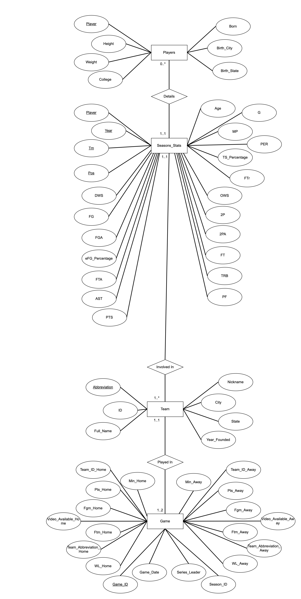

# NBA
SQL RDD and Web-App for data on NBA games, teams, and players 

### Datasets
From https://www.kaggle.com/wyattowalsh/basketball \
**Game** 62448 rows, 149 columns \
**Team** 30 rows, 7 colums 

From https://www.kaggle.com/drgilermo/nba-players-stats \
**Players** 3922 rows, 8 colums \
**Seasons_Stats** 24691 rows, 53 colums\
Result: data_original 

### Data Cleaning,Database Design and Entity Resolution
Step1:(cleaning1.ipynb)\
Use Pandas to clean Null Values,duplicate rows and columns that are mostly nulls.(preprocessing1.ipynb)\

Step2:(cleaning2.sql)\
Delete rows from Game where participating teams are dated that they do not have team information\
Delete rows from Seasons_Stats where involved teams are dated that they do not have team information\
Changed Team name abbrivations in Game to current used abbreviation in consistent with Team Table.\
Note: This step uses SQL and done in a separate database named Test(This database has been dropped, only resulted excel exported.)

Step3:(cleaning3.ipynb)\
Dropped some duplicate columns and redundant dependent column in Game and Seasons_stats to keep schema in 3NF\
Justify to make sure that each schema is in 3NF(see normalization concerns.pdf)\
Result: data_cleaned

Later changes in RDS: cleaned records in Game before season 1950 and after season 2017 to keep Game consistent with seasonal stats.

### Web App
The back-end and API of the application is built on Node.js and the RDS is hosted on AWS MySQL server.
The front-end is based on React and compatible libraries such as [React Suite](https://rsuitejs.com/).

### Run The App Locally
Please follow the instructions below in order to run the web app locally.

#### 1. node.js setup
Download and install node.js via this [link](https://nodejs.org/en/download/).
Run the following line in your terminal to make sure your versions are up-to-date
```
npm -v
node - v
```

#### 2. REACT setup
In your terminal, install react and read-dom
``` 
npm install --save react
```
``` 
npm install --save react-dom
```

* Note: from now on installing with npm might yeild different results based on your environment, so read the output carefully, and try prompted command if needed (**sometimes you would need to use *--froce* if regular install option fails**).

#### 3. Install node modules in the folders
Locate the working directory of the web app, should be something like  
nba/ .... /project.
Open two terminals and run the following command on different terminals. (*npm i* and *npm install* are interchangeable)
```
cd server
npm install
```

```
cd client
npm i
```

#### 4. Download and Install dependencies/libraries
In either of the terminals, run the following commands to install packages for the webpages
```
npm i rsuite --save
npm i echarts --save
npm i react-usa-map --save
npm i rsuite-table --save
npm i react-icons --save
npm i --save @rsuite/icons
npm i --save @rsuite/charts echarts
```

#### 5. See the Webpages
Finally, it's time to run and test the web app.
Make sure you start with the terminal that is on the /server directory, and run
``` 
npm start
```
Then, on the terminal with the /client directory, run the same
``` 
npm start
```

The website should then be automatically opened by the default browser.

* Please contact zsguo@seas.upenn.edu should you ran into any problem following the steps above.
<br>
<br>
<br>
<br>

### Appendix. Entity–relationship model



